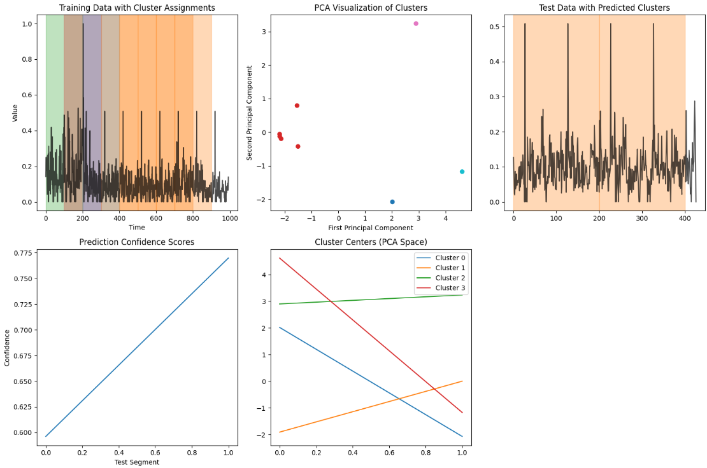
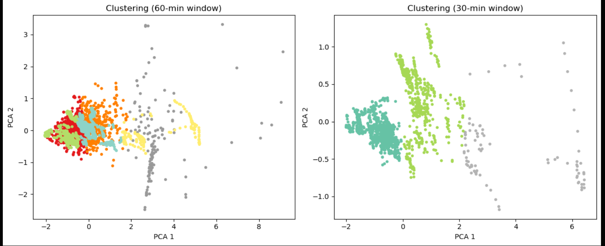

 # :beginner: Yahoo Dataset Time Series Clustering Project

## 프로젝트 개요

이 프로젝트는 Yahoo에서 수집한 시계열 데이터(주가 등)에 대해 다양한 머신러닝 기법을 적용하여 패턴을 자동으로 분류(클러스터링)하는 과정을 다룹니다. 데이터 전처리, 특징 추출, 차원 축소(PCA), K-means 클러스터링, 그리고 결과 시각화까지의 전체 파이프라인을 구현했습니다.

---

## 데이터 전처리

- **1차원 변환:**  
  CSV 파일을 불러온 후 `.ravel()` 또는 `.flatten()`을 사용해 데이터를 1차원 배열로 변환합니다.  
  → 시계열 데이터 처리를 위해 1차원 배열이 필요합니다.

- **스케일링:**  
  `MinMaxScaler`로 데이터를 0~1 사이로 정규화합니다.  
  → K-means와 같은 거리 기반 알고리즘은 데이터가 같은 범위에 있을 때 더 잘 동작합니다.

- **훈련/테스트 분리:**  
  전체 데이터의 70%는 훈련용, 30%는 테스트용으로 분리합니다.

---

## 특징 추출

- **세그먼트 분할:**  
  데이터를 50, 100, 200 길이의 세그먼트로 50%씩 겹치게 슬라이딩 윈도우로 나눕니다.

- **기본 특징:**  
  평균, 표준편차, 최대값, 최소값, 스파이크 개수, 중간 피크 개수, 이상치 개수 등

- **고급 특징:**  
  중앙값, 사분위수 범위(IQR), 강한 이상치 개수, 선형 추세(기울기), 피크 개수, 주파수 영역 평균(FFT)

---

## 차원 축소 및 클러스터링

- **표준화:**  
  `StandardScaler`로 특징을 표준화합니다.

- **PCA 적용:**  
  전체 분산의 95%를 유지하면서 차원을 10개에서 2개로 축소합니다.  
  → 시각화와 클러스터링 성능 향상

- **K-means 클러스터링:**  
  PCA 결과에 대해 K-means를 적용해 데이터의 패턴을 자동으로 군집화합니다.

---

## 테스트 데이터 평가

- 테스트 데이터에도 동일한 특징 추출, 스케일링, PCA를 적용합니다.
- 학습된 K-means 모델로 각 세그먼트의 군집을 예측하고, 클러스터 중심과의 거리를 기반으로 신뢰도(Confidence Score)를 산출합니다.

---

## 결과 시각화

- **좌상:** 훈련 데이터의 클러스터 할당 결과 (색상별로 구간 구분)
- **중상:** PCA 공간에서의 클러스터 분포 (군집 간 경계가 명확)
- **우상:** 테스트 데이터의 예측 클러스터 결과
- **좌하:** 테스트 세그먼트별 예측 신뢰도(Confidence)
- **중하:** PCA 공간에서의 클러스터 중심 비교
- **우하:** 최종 수치 요약

---

# 클러스터링 결과 해석  
> ⚠️ 아래 내용은 `yahoo_clustering_model2` 모델의 분석 결과임을 참고하세요.

## 📍 60분 윈도우 클러스터링 (왼쪽 그래프)

- 🔴 오른쪽 끝에 퍼져 있는 클러스터들 (예: PCA 1 값이 3 이상인 회색/노란 점들)  
  ✅ 트래픽 양이 높고 변동성도 큰 구간  
  평균(mean)과 표준편차(std)가 모두 높은 구간에서 나타남  
  이벤트 발생, 갑작스러운 사용자 증가 등 불안정하거나 혼잡한 시간대

- 🟢🟦 왼쪽 영역의 클러스터들 (PCA 1이 0 이하)  
  ✅ 트래픽이 낮고 매우 안정적인 시간대  
  새벽 시간대나 비활성 시간대로 추정됨

- 🟠🟥 중앙 부분 클러스터들 (PCA 1이 0~2 사이)  
  ✅ 보통 수준의 트래픽과 중간 정도의 변동성  
  일반적인 주간 사용 시간대에 해당할 가능성이 높음

## 📍 30분 윈도우 클러스터링 (오른쪽 그래프)

- 🟩 초록색 클러스터 (중앙 위쪽)  
  ✅ 중간에서 높은 트래픽, 약간의 변동성  
  일정한 형태로 밀집되어 있음 → 꾸준한 사용자 활동 시점

- 🟦 청록색 클러스터 (왼쪽 하단)  
  ✅ 트래픽이 낮고 안정적  
  사용자 활동이 거의 없는 시간대 (예: 새벽)

- ⚪ 회색 점들 (가장자리 또는 멀리 흩어진 부분)  
  ✅ 이상치(Outliers)  
  매우 드문 이벤트나 갑작스러운 트래픽 변화가 있을 수 있음
  

---

## 최종 결과 요약

- **Training silhouette score:** 0.525  
  → 0.5 이상으로, 군집 품질이 양호함을 의미합니다.
- **Number of test segments:** 2
- **Cluster distribution in test:** {1: 1, 2: 1}
- **Average prediction confidence:** 0.683  
  → 예측 신뢰도가 높아, 실제 데이터에도 군집화가 잘 적용됨을 확인

---

## 결론

- **군집 품질:** 실루엣 점수와 시각화 모두에서 군집이 잘 분리됨을 확인할 수 있습니다.
- **일관성:** 훈련/테스트 데이터 모두에서 안정적으로 패턴이 분류됨
- **활용성:** 이 파이프라인은 이상 탐지, 패턴 분류, 비즈니스 의사결정 지원(예: 광고 타이밍, 유지보수 시점 선정 등)에 활용할 수 있습니다.

---
# 최종 성능 평가
> ⚠️ 아래 내용은 `yahoo_clustering_final` 모델의 분석 결과임을 참고하세요.
- 

## 참고

- 프로젝트 코드 및 노트북 보기:
  - [model1](https://github.com/asyraf34/yahoo_dataset_documentation/blob/main/yahoo_clustering_model1.ipynb)
  - [model2](https://github.com/asyraf34/yahoo_dataset_documentation/blob/main/yahoo_clustering_model2.ipynb)
  - [final](link.ipynb)
- 데이터: Yahoo Finance 시계열 데이터
- 주요 라이브러리: pandas, numpy, scikit-learn, matplotlib, scipy

